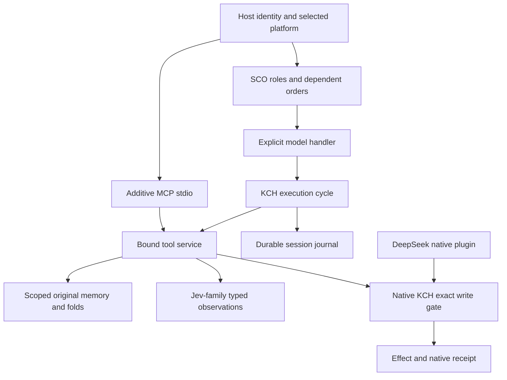

# KCH composed runtime 0.1.0

An additive execution layer for KCH: durable sessions, an explicit model/tool cycle,
recoverable memory, SCO execution and typed decision sensors. The existing full KCH
distribution remains the owning platform. This package does not replace SuperMCP,
Jarvis/Telegram, CSI, KwanDocs, KwanBlocks, CONSTRUCT or their native implementations.

This increment is implemented against KCH main `714892929ff7d840746ae568d7217af588159053`,
SCO release stage v0.1.1 and Native r33 0.11.33. It requires Python 3.11+ and Linux/POSIX
(`flock`, directory `fsync`); there is no claim of Windows portability.

## Connected components



- `runtime.py` connects preserved provider messages to real tools. A response is
  persisted before tool execution. The selected endpoint/model/options bind to the
  session. There is no implicit provider switch, retry, model or key.
- `journal.py` retains exact JSON messages and call receipts with a scoped hash chain
  and checked projections. Reusing a call ID with different arguments fails. A call
  left STARTED cannot be repeated automatically. This is conservative recovery, not
  a promise of universal exactly-once external effects.
- `memory.py` retains original bytes, revision/provenance seals, contiguous and nested
  fold manifests, exact unfolding, scoped search, budgeted views and transitive
  invalidation after correction. Folding is an index operation; it is not a learned
  semantic summarizer and does not silently compress provider conversation history.
- `coordinator.py` extends the existing SCO ledger with bounded parallel execution,
  dependency scheduling, reservations and recoverable receipt publication.
  `bindings.make_model_handler` connects its orders to the KCH model cycle. Trusted
  adapters are required; arbitrary Python handlers are not sandboxed.
- `sensors.py` connects host-registered System One callables and historical RDSS
  receipts. Choice/Score/Noul remain observations with authority NONE. See
  [Jev integration](docs/JEV.md).
- `plugins/deepseek` invokes the existing KCH hook at DeepSeek's real guard boundary,
  with source pins and final native receipts. See its own README for launcher patches.
- `mcp.py` exposes only connected tools over newline-delimited stdio JSON-RPC. It is
  an additive server for OpenClaw, QwenPaw, Codex, Cline or another conforming client;
  host-specific activation must still be verified. See [profiles](profiles/README.md).

## Run locally

From this directory, no install or dependency download is needed:

```sh
export PYTHONPATH="$PWD/src"
python -m unittest discover -s tests -v
python -m kch_composed --help
```

Every CLI command requires explicit `--repository`, `--workspace`, `--state` (a
directory), `--principal` and `--session`. These are trusted local host settings;
`principal` is not a login or remote authentication mechanism. `inspect` reports
the configured tools, call states and derived native authorization session ID.
`invoke --call-id ID --tool NAME --arguments-file FILE` invokes an actual tool.
`recover-tools` completes persisted calls without requesting a model. `cancel` and
`resume` control the bound session. Cancellation is checked before each new operation
and immediately before a native-authorized write; it cannot undo an effect underway.

`run --endpoint URL --model ID --prompt-file FILE` makes real model requests.
For remote HTTPS, supply `--api-key-env ENV_NAME`; the key remains in the request header.
Provider options are explicit through `--options-file FILE`. `--retry-model`
acknowledges uncertain model delivery, never uncertain tool execution. Native provider
reasoning fields stay with that session. See [transport contract](docs/MODEL_TRANSPORT.md).

Default tools read workspace files and maintain session-local memory. `--enable-write`
adds exclusive **new-file** creation only. It also requires `--native-data`, existing
native locks enabled, an exact `tool:write` lock, and an exact consumable KCH grant.
The adapter never creates grants or enables locks. A denied proposal is a terminal
attempt: after an actual user grant, submit a **new call ID** with the same authorized
arguments. The native session is a hash of principal/workspace/session, exposed by
`inspect`, not the bare CLI session name. Overwriting, shell execution and remote
delivery are not exposed by this package's own loop.

For SCO model handlers, order authority must include `MODEL_INFERENCE` and
`tool:<name>` for each exposed tool. Backend factory, principal and tool selection are
host-bound. A model's declaration of completion is retained as such; it does not prove
scientific correctness or satisfy an independent reviewer gate.

## Evidence and boundaries

Run the Python suite above for local behavior. The tests use real repository files,
actual SQLite state and explicit contract/adversarial fixtures. Provider transport
tests use loopback HTTP; sensor tests use labeled primary-document examples. These
are not model benchmarks or simulated claims of live inference. DeepSeek tests use
the original upstream AgentLoop and filesystem tools; their pinned checkout and
commands are in `plugins/deepseek/README.md`.

The own generative cycle and the SCO model-handler connection require acceptance
against a real user-selected endpoint; no paid model evaluation was performed here.
OpenClaw/QwenPaw configuration is prepared and stdio tested, not activated on the
user's hosts. MCP exposure does not intercept those hosts' other native tools.

Local state can contain exact source material and provider-native reasoning. Place
it outside source control and bind access to the intended OS user. Hashes detect
accidental corruption and inconsistent projections, not a malicious owner rewriting
the whole database and its seals. Shared-machine authentication, hardened sandboxes,
semantic memory evaluation, automatic compaction policy, cloud deployment and complete
full-KCH tool federation remain separate integration work. Mechanisms and source
attribution are listed in [INTEGRATION_MAP.md](INTEGRATION_MAP.md).
